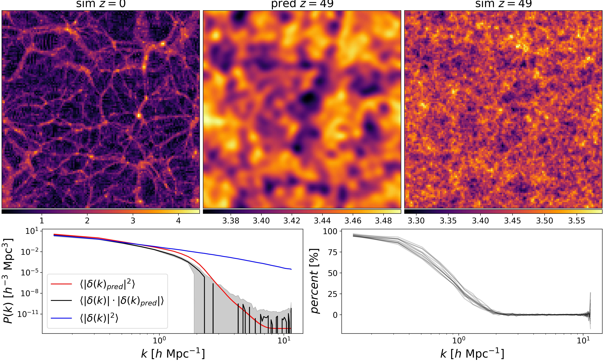

# Master Thesis



Understanding the evolution of known structures in the universe is challenging. Although we can
theoretically reverse gravitational N-body simulations, inverse simulations are not feasible because
we cannot recover the complete velocity vectors of observed structures. Another approach is to
predict an approximation of the initial conditions of a forward simulation given the nal state.
This problem is typically solved using an iterative optimization method that relies on the forward
simulation in its objective function. However, this method is computationally expensive. In this
thesis, we explore a data-driven operator learning approach capable of predicting initial conditions
directly from a nal density distribution. To accomplish this, we generate large quantities of time-
aggregated simulation data using PKDGRAV3 [Potter et al., 2017]. The operator is based on an
adaptation of the Fourier neural operator (FNO) [Li et al., 2020], which inherently exploits periodic
boundary conditions because it operates in Fourier space. Our model accurately predicts large-scale
dark matter structures and can recover small-scale structures beyond the nonlinear threshold k = 1.
Additionally, we demonstrate that increasing the number of intermediate prediction steps improves
reconstruction accuracy, showcasing the potential of operator learning as a surrogate for full-eld
gravitational N-body simulations.

## Structure of the code

The main code is organized in the ``src`` folder we ``train.py`` serves as the entry point for training the model. There are two models implemented, a 3D UNET and a 3D FNO (Furier Neural Operator). The models can be found in ``src/nn/``. The code also includes different methods mass assignment and grid interpolations, which are implemented in JAX and therefore fully differentiable. The differentiable property is leveraged in ``src/field/fit_field.py``, which can be used to fit the particle positions to a 3D density field. 

## Data Analsysis on slurm machines

### Installation

1. Create a new interactive session ```srun --pty -n 1 -c 8 --time=01:00:00 --mem=16G --gres=gpu:1 bash -l``` 
2. Load Conda ```module load anaconda3```
3. Create env 

```
python -m venv ml-env
source .env/bin/activate
pip install -U "jax[cuda12]"
pip install nvidia-dali-cuda120
pip install optax equinox matplotlib pyfftw powerbox
conda install -c bccp nbodykit
conda update -c bccp --all
```

### Power Spectrum Plots

We need a different environment for the nbodykit library due to python compatbility issues.

```
conda create --name nbodykit-env python=3.8
conda install -c bccp nbodykit
```

### Train & Eval

1. Create a new interactive session ```srun --pty -n 1 -c 8 --time=01:00:00 --mem=16G --gres=gpu:1 bash -l --gpus=A100:1``` 
2. Load Conda ```module load anaconda3```
3. Load env ```source activate myenv```
4. Train model ```python src/train.py default_config.yaml```
5. Evaluate model ```python src/evaluate.py default_config.yaml```

## Data Generation

### Installing pkdgrav

Clone this repo then updat the submodules
```git submodule update --init --recursive```
and change to the dev branch of pkdgrav
```git checkout develop```. If you want to update the submodule to the latest version do
``` git submodule update --remote```.
Install all the deps for pkdgrav (Ubuntu only, check here for other https://pkdgrav3.readthedocs.io/en/latest/install.html)

```{bash}
sudo apt update
sudo apt install -y autoconf automake pkg-config cmake gcc g++ make gfortran git
sudo apt install -y libfftw3-dev libfftw3-mpi-dev libgsl0-dev libboost-all-dev libhdf5-dev libmemkind-dev libhwloc-dev
sudo apt install -y python3-dev cython3 python3-pip python3-numpy python3-ddt python3-nose python3-tomli
```
Optionally install CUDA on the machine, make sure to link it in PATH and LD_LIBRARY_PATH.

Create a new python env

```{bash}
python -m venv .env
source .env/bin/activate
pip install -r pkdgrav3/requirements.txt
```

cd into pkdgrav submodule and

```
cmake -S . -B build
cmake --build build
```

### Connect to cscs on windwos

Setup:
1. Install python
2. ```git clone https://github.com/eth-cscs/sshservice-cli```
3. ```python -m venv mfa```
4. With admin rights ```Set-ExecutionPolicy -ExecutionPolicy Unrestricted```
5. Activate the python env ```.\venv\Scripts\activate```
6. ```pip install -r requirements.txt```
7. edit config  ```notepad.exe C:\Users\<USER>\.ssh\config``` and add: 
```
Host cscs
	User <USERNAME>
	HostName daint.cscs.ch
	ProxyJump <USERNAME>@ela.cscs.ch
```

This steps have to be repeated every day to get a new key.
1. check if ssh-agent is running with ```Get-Service ssh-agent```
2. if not running start it with ```Get-Service ssh-agent | Set-Service -StartupType Automatic``` and ```Start-Service ssh-agent```
3. Activate the python env ```.\venv\Scripts\activate```
4. execute the ssh-gen script ```python .\sshservice-cli\cscs-keygen.py``` and enter credentials. No password needed. 
5. add key

6. connect with ```ssh cscs``` or use vs code remote ssh extension

### Run data generation on SLURM system

1. load modules (Specific for Eiger CSCS) ```module load cray && module swap PrgEnv-cray PrgEnv-gnu && module load cpeGNU GSL Boost cray-hdf5 cray-fftw CMake cray-python hwloc```
2. run ```bash slurm/generate_data.sh```
3. check task by squeue and filter by username ```squeue -u <USERNAME>```
4. if needed cancel task with ```scancel <JOBID>```

## Testing

Make sure pytest is installed and run ```python -m pytest``` from the root directory. 
